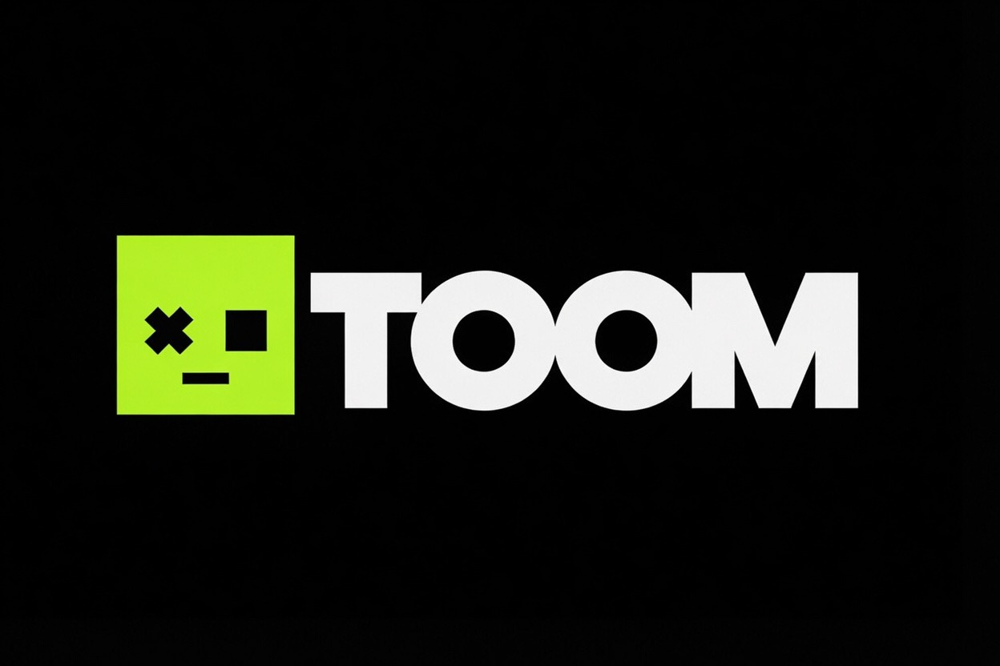

<!-- Logo TOOM: podmień plik assets/branding/logo.png, aby zaktualizować logo -->
<p align="center">
  
</p>

# TOOM

**Personal Commerce Intelligence Platform**

Osobisty asystent sprzedaży e-commerce działający 24/7 na Raspberry Pi 4,
zbudowany zgodnie z Clean Architecture i architekturą pluginów.
Bot Telegram występuje pod nazwą **TOOM**.

## Spis treści

- [Architektura](#architektura)
- [Wymagania](#wymagania)
- [Instalacja](#instalacja)
- [Konfiguracja](#konfiguracja)
- [Uruchomienie](#uruchomienie)
- [Struktura folderów](#struktura-folderów)
- [Dodawanie nowego marketplace](#dodawanie-nowego-marketplace)
- [Backup i odzyskiwanie](#backup-i-odzyskiwanie)
- [Aktualizacja](#aktualizacja)
- [Testy](#testy)
- [Deployment](#deployment)
- [Jakość kodu](#jakość-kodu)
- [Branding](#branding)

## Architektura

Projekt zbudowany jest zgodnie z Clean Architecture i architekturą
pluginów - szczegóły w [docs/architecture.md](docs/architecture.md).

Kluczowe zasady:
- Logika biznesowa (`domain/`, `services/`) nie zależy od żadnego
  konkretnego marketplace.
- Allegro to plugin implementujący interfejs `MarketplacePlugin` -
  dodanie Amazon/eBay/Shopify wymaga jedynie nowego folderu w
  `infrastructure/plugins/`, bez zmiany istniejącego kodu.
- Komunikacja między modułami odbywa się przez Event Bus.
- Cała aplikacja wykorzystuje Dependency Injection przez `app/container.py`.

## Wymagania

- Raspberry Pi 4 Model B (4GB) z SSD podłączonym przez USB 3.0
- Raspberry Pi OS 64-bit (pełna wersja, nie Lite)
- Python 3.13 (instalowany przez `uv`)
- Konto deweloperskie Allegro (produkcyjne lub sandbox)
- Bot Telegram (utworzony przez [@BotFather](https://t.me/BotFather)) -
  nazwij go np. "TOOM"

## Instalacja

Pełna instrukcja przygotowania Raspberry Pi znajduje się w
[docs/deployment.md](docs/deployment.md). Skrócona wersja:

```bash
git clone https://github.com/TWOJA_NAZWA/toom.git
cd toom
uv sync
cp .env.example .env
# Uzupełnij .env swoimi danymi (patrz sekcja Konfiguracja)
uv run alembic upgrade head
```

## Konfiguracja

Wszystkie zmienne środowiskowe opisane są w `.env.example`. Kluczowe kroki:

1. **Allegro**: zarejestruj aplikację na
   https://apps.developer.allegro.pl/ (typ "Allegro Auth Code with PKCE"),
   redirect URI: `http://localhost:53682/auth/callback`.
2. **Telegram**: utwórz bota przez @BotFather (np. pod nazwą TOOM),
   pobierz token, oraz swój `chat_id` (np. przez
   [@userinfobot](https://t.me/userinfobot)).
3. **Klucz szyfrowania tokenów**:
   ```bash
   uv run python -c "from cryptography.fernet import Fernet; print(Fernet.generate_key().decode())"
   ```

## Uruchomienie

### Pierwsza autoryzacja Allegro (jednorazowo)

Przy pierwszym uruchomieniu aplikacja poprosi o autoryzację OAuth2 -
otwórz wyświetlony link w przeglądarce i zaloguj się na konto Allegro.

### Uruchomienie testowe

```bash
uv run python -m app.main
```

### Uruchomienie produkcyjne (systemd)

Zobacz [docs/deployment.md](docs/deployment.md).

## Struktura folderów

```
src/app/
├── api/               # Endpointy FastAPI (health, backup)
├── bot/                # Komendy i middleware Telegram (bot TOOM, aiogram)
├── core/               # Konfiguracja, logowanie, Event Bus
├── database/            # Silnik SQLAlchemy, modele ORM
├── domain/              # Encje biznesowe i interfejsy (serce aplikacji)
├── infrastructure/       # Pluginy marketplace, integracja Telegram
├── repositories/         # Implementacje dostępu do danych (SQLite)
├── scheduler/            # Zadania cykliczne (APScheduler)
├── services/             # Logika aplikacyjna (use cases)
├── shared/               # DTO współdzielone między warstwami
└── utils/                # Funkcje pomocnicze
```

Pełny opis każdego folderu: [docs/architecture.md](docs/architecture.md).

## Dodawanie nowego marketplace

Zobacz [docs/adding_new_marketplace.md](docs/adding_new_marketplace.md).

## Backup i odzyskiwanie

```bash
./scripts/backup_db.sh
./scripts/restore_db.sh backups/toom_manual_20260717_030000.db
```

Szczegóły: [docs/backup.md](docs/backup.md).

## Aktualizacja

```bash
cd toom
sudo systemctl stop toom
git pull
uv sync
uv run alembic upgrade head
sudo systemctl start toom
sudo systemctl status toom
```

## Testy

```bash
uv run pytest -v
uv run pytest --cov=app --cov-report=term-missing
```

## Deployment

Pełna instrukcja: [docs/deployment.md](docs/deployment.md).

## Jakość kodu

```bash
uv run black src/ tests/
uv run ruff check src/ tests/
uv run mypy src/
uv run pre-commit run --all-files
```

## Branding

Zasoby marki (logo, paleta kolorów) znajdują się w
[assets/branding/](assets/branding/). Kolor przewodni: Neon Lime
`#C6FF00` na tle `#111111`. Szczegóły: [docs/branding.md](docs/branding.md).

## Status projektu

✅ W pełni funkcjonalny (Etapy 1-16 ukończone)
